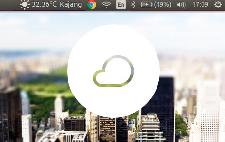
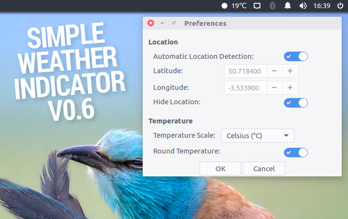

Simple Weather Indicator is an elegant and very simple weather indicator for Ubuntu unity and Gnome 3. It is developed with Python and uses an in-house free/open source Weather API called [Eris](http://eris.madadipouya.com/) to get the current weather condition of the user's location.



## Features

- Simple & elegant
- Configurable
	- Automatic/manual location detection
	- Show/hide location
	- Enable/disable indicator startup
	- Temperature scale suppert (Celsius, Fahrenheit)
	- Rounding weather temperature
- Feature-rich
    - Overall weather condition
    - Humdity level
    - Wind speed
    - Weather cloudiness
    - Weather pressure
    - Weather visibility

- Small footprint
- Available through PPA
- Free and public API ([Eris Weather API](http://eris.madadipouya.com/))
- GPL v3.0 licensed

## Screenshots

Here are a few screenshots of Simple Weather Indicator:

